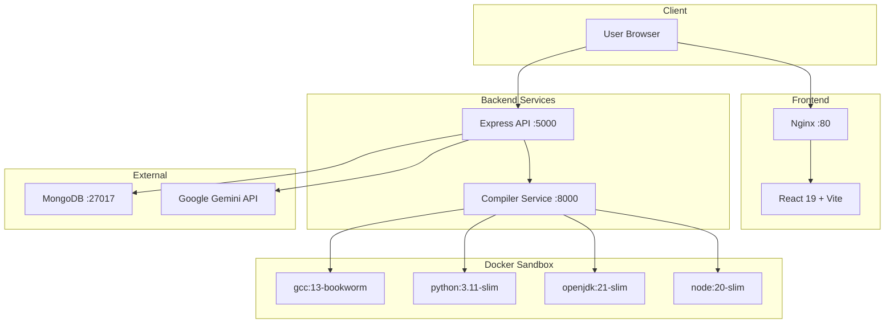

# ⚡ CodeArena — Online Judge

```
   ____          _         _                            
  / ___|___   __| | ___   / \   _ __ ___ _ __   __ _   
 | |   / _ \ / _` |/ _ \ / _ \ | '__/ _ \ '_ \ / _` |  
 | |__| (_) | (_| |  __// ___ \| | |  __/ | | | (_| |  
  \____\___/ \__,_|\___/_/   \_\_|  \___|_| |_|\__,_|  
```

[](../../actions)
[](#-quick-start)
[](https://nodejs.org)
[](https://www.mongodb.com)
[](LICENSE)

> A production-ready competitive programming judge with Docker-sandboxed code execution and Gemini AI debugging.

---

## ✨ Features

- 🔒 **Docker-Sandboxed Execution** — C++, Python, Java, JavaScript run in isolated containers with strict memory, CPU, and network limits
- 🤖 **Gemini AI Debugger** — Streaming explanations, progressive hints, and complexity analysis powered by Google Gemini
- 📊 **Real-time Leaderboard** — Track your rank against other competitive programmers
- ⚡ **Monaco Editor** — VS Code's editor in the browser with syntax highlighting and IntelliSense
- 🚀 **CI/CD with GitHub Actions** — Automated linting, testing, Docker builds, and EC2 deployment
- 🐳 **Fully Containerized** — One-command deployment with Docker Compose
- 🛡️ **Production-Hardened** — Helmet, rate limiting, CORS, JWT auth, and global error handling

---

## 🏗️ Architecture



---

## 🛠️ Tech Stack

| Service | Technology |
|---------|-----------|
| **Frontend** | React 19, Vite, TailwindCSS v4, Monaco Editor, Lucide React |
| **Backend API** | Express.js v5, Mongoose, JWT, Helmet, Morgan, express-rate-limit |
| **Compiler** | Express.js, Dockerode, Docker containers for code execution |
| **Database** | MongoDB 7 |
| **AI** | Google Gemini 1.5 Flash |
| **CI/CD** | GitHub Actions (lint, test, build, deploy) |
| **Deployment** | Docker Compose, Nginx, AWS EC2 |

---

## 🚀 Quick Start

```bash
# 1. Clone the repository
git clone https://github.com/your-username/online-judge.git

# 2. Navigate to the project
cd online-judge

# 3. Copy environment files
cp backend/.env.example backend/.env
cp compiler/.env.example compiler/.env
cp frontend/.env.example frontend/.env

# 4. Fill in your secrets in backend/.env (GEMINI_API_KEY, etc.)

# 5. Start everything with Docker Compose
docker-compose up -d --build
```

The app will be available at:
- **Frontend**: http://localhost:3000
- **Backend API**: http://localhost:5000
- **Compiler**: http://localhost:8000

### Local Development (without Docker)

```bash
# Install root dependencies
npm install

# Install service dependencies
cd backend && npm install && cd ..
cd compiler && npm install && cd ..
cd frontend && npm install && cd ..

# Run all three services concurrently
npm run dev
```

---

## 🔐 Environment Variables

### Backend (`backend/.env`)

| Variable | Description | Default |
|----------|-------------|---------|
| `MONGO_URI` | MongoDB connection string | `mongodb://mongodb:27017/online-judge` |
| `JWT_SECRET` | Secret key for JWT signing | — |
| `GEMINI_API_KEY` | Google Gemini API key | — |
| `PORT` | Server port | `5000` |
| `NODE_ENV` | Environment | `development` |
| `FRONTEND_URL` | Frontend URL for CORS | `http://localhost:5173` |
| `COMPILER_SERVICE_URL` | Compiler service URL | `http://localhost:8000` |

### Compiler (`compiler/.env`)

| Variable | Description | Default |
|----------|-------------|---------|
| `MAIN_BACKEND_API_URL` | Backend API URL for reporting verdicts | `http://localhost:5000` |
| `PORT` | Server port | `8000` |
| `EXECUTION_TIMEOUT` | Max code execution time (ms) | `10000` |
| `MAX_CODE_SIZE_KB` | Max code size in KB | `100` |

### Frontend (`frontend/.env`)

| Variable | Description | Default |
|----------|-------------|---------|
| `VITE_API_BASE_URL` | Backend API URL | `http://localhost:5000` |
| `VITE_COMPILER_URL` | Compiler service URL | `http://localhost:8000` |

---

## 📡 API Endpoints

### Authentication

| Method | Route | Auth | Description |
|--------|-------|------|-------------|
| POST | `/api/auth/register` | ❌ | Create new user account |
| POST | `/api/auth/login` | ❌ | Login and receive JWT cookie |
| POST | `/api/auth/logout` | ❌ | Clear auth cookie |

### Problems

| Method | Route | Auth | Description |
|--------|-------|------|-------------|
| GET | `/api/problems` | ❌ | List all problems (paginated) |
| GET | `/api/problems/:id` | ❌ | Get problem by ID |
| POST | `/api/problems` | 🔐 Admin | Create new problem |
| DELETE | `/api/problems/:id` | 🔐 Admin | Delete problem |

### Users

| Method | Route | Auth | Description |
|--------|-------|------|-------------|
| GET | `/api/user/stats` | 🔐 | Get current user stats |
| GET | `/api/user/leaderboard` | ❌ | Get global leaderboard |
| GET | `/api/user/public/:userId` | ❌ | Get public profile |

### AI Features

| Method | Route | Auth | Description |
|--------|-------|------|-------------|
| POST | `/api/ai/debug` | 🔐 | AI code debugger (SSE stream) |
| POST | `/api/ai/hint` | 🔐 | Progressive hints |
| POST | `/api/ai/complexity` | 🔐 | Time/space complexity analysis |
| POST | `/api/gemini/analyze` | 🔐 | Legacy code analysis |

### Compiler

| Method | Route | Auth | Description |
|--------|-------|------|-------------|
| POST | `/compiler/run` | ❌ | Run code with custom input |
| POST | `/compiler/submit` | ❌ | Submit code against test cases |

### Health

| Method | Route | Auth | Description |
|--------|-------|------|-------------|
| GET | `/api/health` | ❌ | Health check (used by Docker) |

---

## 🔄 CI/CD

### CI Pipeline (`.github/workflows/ci.yml`)
Triggers on every push and PR to `main`:
1. **Lint & Test** — ESLint on all services + backend smoke test with MongoDB
2. **Docker Build** — Builds all 3 Docker images and verifies the stack starts

### Deploy Pipeline (`.github/workflows/deploy.yml`)
Triggers on push to `main`:
1. SSHs into EC2 instance
2. Pulls latest code, rebuilds Docker images
3. Verifies health check post-deployment
4. Rolls back with error logs if health check fails

### Required GitHub Secrets

| Secret | Description |
|--------|-------------|
| `EC2_SSH_KEY` | Private SSH key for EC2 instance |
| `EC2_HOST` | Public IP or domain of EC2 |
| `MONGO_URI` | Production MongoDB URI |
| `JWT_SECRET` | Production JWT secret |
| `GEMINI_API_KEY` | Google Gemini API key |

---

## 🔒 Security — Docker Sandbox

Every code submission runs in a fresh Docker container with these constraints:

| Constraint | Value |
|-----------|-------|
| Memory Limit | 256 MB (no swap) |
| CPU Quota | 50% of one core |
| Network | **Disabled** |
| Root Filesystem | **Read-only** |
| Writable Space | `/tmp` tmpfs (64 MB) |
| Capabilities | **ALL dropped** |
| Privileges | `no-new-privileges` |
| PID Limit | 50 (prevents fork bombs) |
| Timeout | 10 seconds |
| Auto-Remove | Container self-deletes after run |

---

## 🤝 Contributing

1. **Fork** the repository
2. **Create** a feature branch (`git checkout -b feature/amazing-feature`)
3. **Commit** your changes (`git commit -m 'Add amazing feature'`)
4. **Push** to the branch (`git push origin feature/amazing-feature`)
5. **Open** a Pull Request

---

## 📄 License

This project is licensed under the MIT License.
